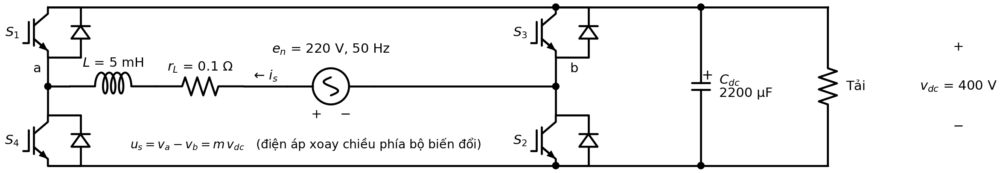
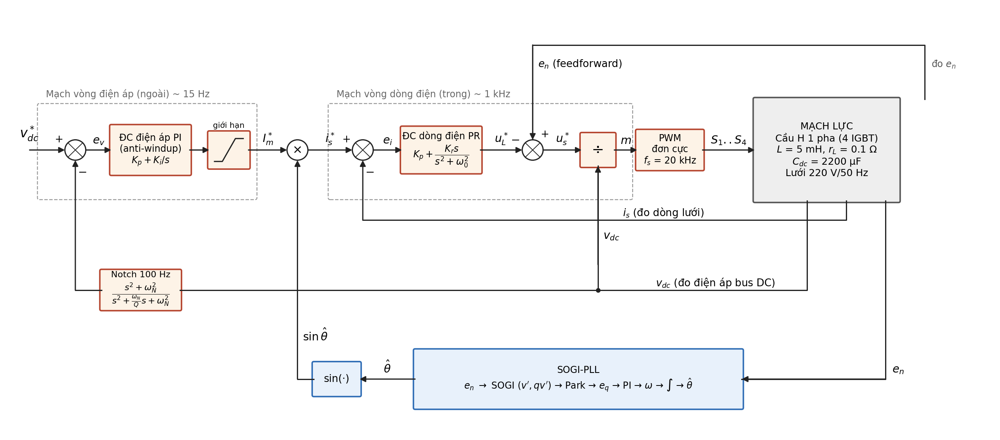
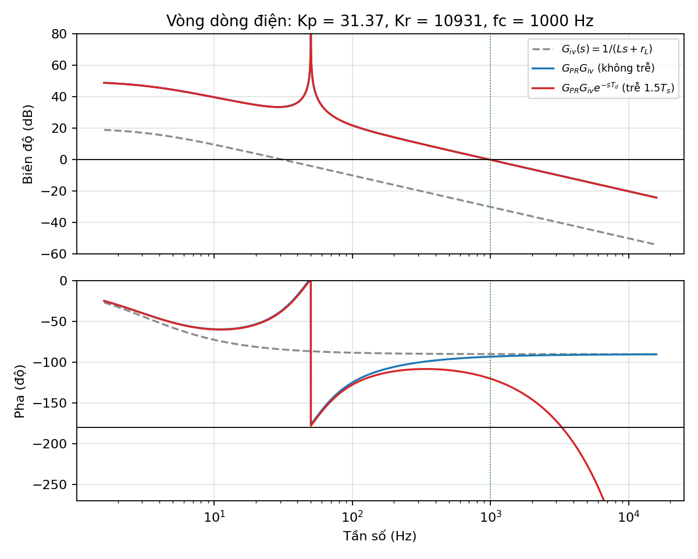
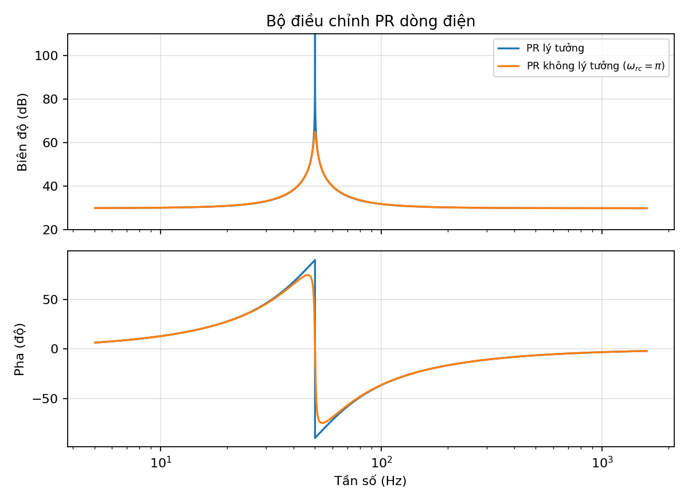
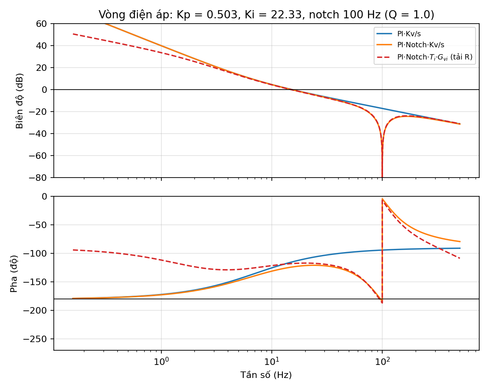
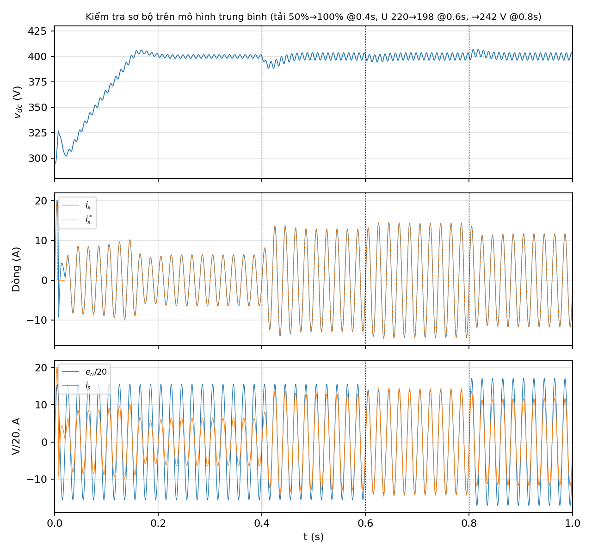

# Thiết kế hệ thống điều khiển chỉnh lưu tích cực 1 pha (EE4331 – Bài 26)

> Nội dung Phần 1–3 (lý thuyết, tính toán). Phần 5 (điều khiển số – Tustin) ở [Phan5_Dieu_khien_so_Tustin.md](Phan5_Dieu_khien_so_Tustin.md).
> Mọi con số trong tài liệu đều được tính bởi [design_calc.py](design_calc.py) (kết quả in ở [design_output.txt](design_output.txt)); tham số cho Simulink nằm trong [params_active_rectifier.m](params_active_rectifier.m).
> Tài liệu tham chiếu: bài giảng *"Thiết kế điều khiển tuyến tính cho bộ biến đổi nghịch lưu nguồn áp một pha"* – PGS.TS Vũ Hoàng Phương (gọi tắt là **[BG]**, số trang ghi theo slide).

**Quy ước dấu dùng xuyên suốt:** dòng $i_s$ có chiều **từ lưới vào bộ biến đổi** (quy ước "động cơ"), nên công suất $P>0$ nghĩa là lấy từ lưới nạp cho bus DC. [BG] dùng quy ước ngược lại (dòng đi ra lưới, chế độ nghịch lưu), vì vậy ở [BG] tr.26–27 hàm truyền vòng áp và $K_p, K_i$ mang dấu âm. Với quy ước của chúng ta, mọi hệ số đều dương.

---

## PHẦN 1. BÀI TOÁN THIẾT KẾ

### 1.1 Yêu cầu thiết kế

| Thông số | Ký hiệu | Giá trị |
|---|---|---|
| Điện áp lưới | $U_s$ | 220 V ± 10% (198 … 242 V rms) |
| Tần số lưới | $f$ | 50 Hz ± 1% (49,5 … 50,5 Hz) |
| Công suất thiết kế | $S$ | 2 kVA (PF = 1 ⇒ $P$ = 2 kW) |
| Cuộn cảm lọc | $L$, $r_L$ | 5 mH, 0,1 Ω |
| Tụ bus DC | $C_{dc}$ | 2200 µF |
| Điện áp một chiều | $V_{dc}$ | 400 V |
| Tần số đóng cắt (tự chọn) | $f_s$ | **20 kHz**, điều chế đơn cực |

**Mục tiêu điều khiển:**
1. Giữ điện áp bus DC $v_{dc}$ ổn định ở 400 V khi tải thay đổi và điện áp lưới dao động ±10%.
2. Dòng lưới $i_s$ hình sin, **đồng pha** với điện áp lưới $e_n$ (hệ số công suất ≈ 1), THD thấp (IEEE 1547 / IEC 61727: THD < 5%, sóng hài bậc $h<11$ < 4% – [BG] tr.24).
3. Bám đồng bộ lưới trong dải tần số 49,5 … 50,5 Hz.

### 1.2 Sơ đồ mạch lực

Cầu H gồm 4 IGBT kèm diode ngược ($S_1$…$S_4$). Nhánh AC gồm lưới $e_n$, điện trở $r_L$ và cuộn cảm $L$ nối vào hai điểm giữa cầu a, b. Phía DC gồm tụ $C_{dc}$ và tải.

### 1.3 Tính toán, kiểm tra các phần tử mạch lực

**a) Dòng điện lưới và tải định mức**

$$I_s=\frac{P}{U_s}=\frac{2000}{220}=9{,}09\ \text{A}\quad(\hat I_s=12{,}86\ \text{A})$$

$$I_{s,\max}=\frac{P}{U_{s,\min}}=\frac{2000}{198}=10{,}10\ \text{A}\quad(\hat I_{s,\max}=14{,}28\ \text{A})$$

$$R_{tải}=\frac{V_{dc}^2}{P}=80\ \Omega,\qquad I_{tải}=\frac{P}{V_{dc}}=5\ \text{A}$$

**b) Chọn tần số đóng cắt và kiểu điều chế**

Với điều chế **đơn cực** (unipolar, [BG] tr.5–7) điện áp $u_{ab}$ nhảy giữa $0$ và $\pm V_{dc}$, gợn dòng có tần số $2f_s$. Đập mạch dòng đỉnh–đỉnh lớn nhất (khi $|e_n| = V_{dc}/2$):

$$\Delta I_{pp,\max}^{unipolar}=\frac{V_{dc}}{8Lf_s}=\frac{400}{8\cdot 5\cdot10^{-3}\cdot 20\cdot10^{3}}=0{,}5\ \text{A}\ (\approx 3{,}9\%\ \hat I_s)$$

So sánh: điều chế lưỡng cực cho $\Delta I_{pp}=V_{dc}/(2Lf_s)=2$ A, lớn gấp 4 lần ⇒ chọn đơn cực.

Lý do chọn $f_s = 20$ kHz:
- nằm ngoài dải nghe được, gợn dòng nhỏ (0,5 A) với $L$ = 5 mH cho sẵn;
- IGBT 650 V dòng tốc độ cao làm việc tốt ở 20 kHz, tổn hao đóng cắt chấp nhận được ở 2 kW;
- cho phép băng thông vòng dòng ~1 kHz mà vẫn còn dự trữ cho trễ của điều khiển số (Phần 5): $f_{ci}=1\text{ kHz}=f_s/20 \le f_s/10$ ([BG] tr.25).

**c) Đập mạch điện áp 100 Hz trên bus DC**

Công suất tức thời phía lưới khi $\cos\varphi=1$: $p(t)=e_n i_s = P\,(1-\cos 2\omega t)$. Thành phần $-P\cos 2\omega t$ do tụ gánh:

$$\Delta V_{dc,pp}\approx\frac{P}{\omega C_{dc}V_{dc}}=\frac{2000}{314{,}16\cdot 2200\cdot10^{-6}\cdot 400}=7{,}23\ \text{V}\ (1{,}8\%\ V_{dc})$$

⇒ $C_{dc}$ = 2200 µF đạt yêu cầu (< 2%). Tuy nhiên gợn 100 Hz này **phải được lọc trước khi vào bộ điều chỉnh áp** (xem Phần 2, 3.5).

**d) Kiểm tra điện áp bus DC / hệ số điều chế**

Điện áp phía AC bộ biến đổi cần tạo (phasor, dòng đồng pha lưới):

$$\underline U_s=\underline E_n-(r_L+j\omega L)\,\underline I_s$$

Trường hợp xấu nhất $U_s$ = 242 V, $f$ = 50,5 Hz, $P$ = 2 kW: $|\underline U_s|\sqrt2 = 341{,}6$ V, lệch pha −3,1° so với $e_n$

$$m_{\max}=\frac{341{,}6}{400}=0{,}854<1$$

Còn ~15% dự trữ điện áp cho quá trình quá độ của vòng dòng. Khi $U_s$ = 198 V: $m$ = 0,70. Điều kiện tăng áp $V_{dc} > \hat E_{n,\max}=342$ V được thỏa mãn.

**e) Ứng suất van – gợi ý chọn van**

$$V_{CE,\max}\approx V_{dc}+\tfrac12\Delta V_{dc,pp}=403{,}6\ \text{V},\qquad I_{C,\max}\approx\hat I_{s,\max}+\tfrac12\Delta I_{pp}=14{,}5\ \text{A}$$

Với hệ số an toàn điện áp ~1,5 và dòng ~2 ⇒ chọn IGBT **650 V / ≥ 30 A** có diode ngược tích hợp, loại tốc độ cao (ví dụ dòng TRENCHSTOP™ 5 H5 như IKW40N65H5 – cần kiểm tra lại datasheet khi chốt). Tổn hao đồng trên $r_L$: $r_L I_{s,\max}^2\approx 10$ W.

---

## PHẦN 2. CẤU TRÚC ĐIỀU KHIỂN

Cấu trúc hai mạch vòng lồng nhau (cascade) theo [BG] tr.24 (Hình 5.1), bổ sung notch filter, feedforward và SOGI-PLL:

| Khối | Chức năng | Ghi chú thiết kế |
|---|---|---|
| **Notch 100 Hz** | Lọc gợn $2\omega$ trên $v_{dc}$ đo về | Nếu để gợn 3,6 V (biên độ) đi qua $K_{p,v}$ = 0,5 ⇒ $I_m^*$ dao động ±1,8 A ở 100 Hz ⇒ $i_s^*=(I_m+a\cos2\omega t)\sin\omega t$ sinh **hài bậc 3** biên độ $a/2\approx0{,}9$ A ≈ 7% $\hat I_s$ — vượt giới hạn 4% của IEEE 1547 |
| **ĐC điện áp PI** (+ giới hạn, anti-windup) | Sai lệch $e_v=v_{dc}^*-v_{dc,f}$ → biên độ dòng đặt $I_m^*$ | Giới hạn $0\le I_m^*\le 20$ A; kẹp tích phân (clamping) khi bão hòa |
| **SOGI-PLL** | Ước lượng góc pha $\hat\theta$ và tần số của lưới | Hệ 1 pha không có sẵn tín hiệu trực giao ⇒ SOGI tạo $qv'$ lệch 90° ([BG] tr.28–29) |
| **Nhân $I_m^*\sin\hat\theta$** | Tạo dòng đặt $i_s^*$ hình sin đồng pha lưới | PF = 1; muốn phát/thu công suất phản kháng thì cộng thêm thành phần $\cos\hat\theta$ |
| **ĐC dòng điện PR** | Bám dòng hình sin 50 Hz với sai lệch tĩnh bằng 0 | Lý do dùng PR thay PI: xem mục 3.4 |
| **Feedforward $e_n$** | $u_s^* = e_n - u_L^*$ | Bộ PR chỉ phải tạo điện áp rơi trên $L$ ($u_L^*$), khử nhiễu $e_n$, quá độ khởi động êm |
| **Chia cho $v_{dc}$** | $m=u_s^*/v_{dc}$ | Chuẩn hóa ⇒ khâu PWM + cầu H có hệ số khuếch đại bằng 1, độc lập với gợn/biến động $v_{dc}$ |
| **PWM đơn cực** | So sánh $\pm m$ với sóng mang tam giác 20 kHz | [BG] tr.5, 7 |

**Lưu ý về dấu tại bộ cộng feedforward:** với quy ước $i_s$ đi từ lưới vào ($L\,di_s/dt = e_n - r_L i_s - u_s$), muốn dòng tăng thì phải **giảm** $u_s$, do đó $u_s^* = e_n - u_L^*$ (cổng của $u_L^*$ mang dấu "−"). Nếu nhóm mô phỏng dùng quy ước của [BG] (dòng đi ra lưới) thì $u_s^* = e_n + u_L^*$ và dòng đặt là $-I_m^*\sin\hat\theta$ — hai cách tương đương, chỉ cần nhất quán.

**Trình tự khởi động (gợi ý cho Phần 4):** (1) nạp trước tụ qua các diode ngược (cầu diode không điều khiển, có điện trở hạn dòng) ⇒ $v_{dc}\approx \hat E_n$ ≈ 311 V; (2) PLL khóa pha; (3) cho phép PWM, đặt $v_{dc}^*$ tăng dạng dốc từ 311 V lên 400 V trong ~0,15 s để tránh bão hòa dòng.

---

## PHẦN 3. MÔ HÌNH HÓA, TỔNG HỢP BỘ ĐIỀU CHỈNH

### 3.1 Mô hình đóng cắt

Đặt $S_a, S_b\in\{0,1\}$ là trạng thái van trên của nhánh a, b (van dưới đóng cắt bù). Hàm chuyển mạch của cầu $s = S_a - S_b\in\{-1,0,1\}$:

$$u_s = u_{ab} = s\,v_{dc},\qquad i_{dc}=s\,i_s$$

Áp dụng định luật Kirchhoff cho nhánh AC và nút DC:

$$\begin{cases}
L\dfrac{di_s}{dt} = e_n - r_L\,i_s - s\,v_{dc}\\[2mm]
C_{dc}\dfrac{dv_{dc}}{dt} = s\,i_s - i_{tải}
\end{cases}
\qquad\Longleftrightarrow\qquad
\frac{d}{dt}\begin{bmatrix}i_s\\ v_{dc}\end{bmatrix}=
\begin{bmatrix}-\frac{r_L}{L} & -\frac{s}{L}\\ \frac{s}{C_{dc}} & 0\end{bmatrix}
\begin{bmatrix}i_s\\ v_{dc}\end{bmatrix}+
\begin{bmatrix}\frac1L & 0\\ 0 & -\frac{1}{C_{dc}}\end{bmatrix}
\begin{bmatrix}e_n\\ i_{tải}\end{bmatrix}$$

### 3.2 Mô hình trung bình

Trung bình hóa trong một chu kỳ đóng cắt $T_s$ (bỏ các thành phần tần số $f_s$ trở lên), $s$ được thay bằng hệ số điều chế $m=\bar s\in[-1,1]$ ([BG] tr.4):

$$\begin{cases}
L\dfrac{d\bar i_s}{dt} = e_n - r_L\,\bar i_s - m\,\bar v_{dc}\\[2mm]
C_{dc}\dfrac{d\bar v_{dc}}{dt} = m\,\bar i_s - i_{tải}
\end{cases}$$

Mô hình **phi tuyến** (tích $m\cdot v_{dc}$, $m\cdot i_s$). Khác với bộ Boost trong bài mẫu, **điểm làm việc phía AC không phải hằng số** (dòng, áp, $m$ đều hình sin) nên không tuyến tính hóa trực tiếp quanh một điểm DC được. Ta tách thành hai mô hình theo hai thang thời gian:
- vòng dòng (nhanh): coi $v_{dc}$ = const, dùng phép chia $m=u_s^*/v_{dc}$ để khử phi tuyến;
- vòng áp (chậm): dùng **cân bằng công suất trung bình trên một chu kỳ lưới**, rồi tuyến tính hóa quanh $(V_{dc}, I_{m0})$ ([BG] tr.26).

### 3.3 Hàm truyền đối tượng

**a) Đối tượng vòng dòng điện** $G_{iv}(s)$

Vì $m=u_s^*/v_{dc}$ nên $u_s=m\,v_{dc}=u_s^*$ (khâu PWM + cầu H có hệ số 1, bỏ qua trễ). Với feedforward $u_s^*=e_n-u_L^*$:

$$L\frac{di_s}{dt}+r_Li_s = e_n-u_s = u_L^*\quad\Longrightarrow\quad
\boxed{G_{iv}(s)=\frac{i_s(s)}{u_L^*(s)}=\frac{1}{Ls+r_L}=\frac{1}{0{,}005\,s+0{,}1}}$$

(trùng với [BG] tr.25). Nếu **không** chuẩn hóa theo $v_{dc}$ thì đối tượng từ $m$ đến $i_s$ là $V_{dc}/(Ls+r_L)$ như README.

**Trễ của khâu PWM + lấy mẫu/tính toán số:** $G_{PWM}(s)\approx e^{-sT_d}$, $T_d = 1{,}5\,T_s = 75\ \mu$s (1 chu kỳ tính toán + 0,5 chu kỳ do ZOH/PWM). Ở $f_{ci}$ = 1 kHz trễ này gây thêm −27° pha — không thể bỏ qua nếu sau này thực thi số (Phần 5). Do đó đối tượng dùng để thiết kế:

$$G_{dt}(s)=\frac{e^{-sT_d}}{Ls+r_L}$$

**b) Đối tượng vòng điện áp** $G_{vi}(s)$

Năng lượng tụ: $\dfrac{d}{dt}\left(\tfrac12 C_{dc}v_{dc}^2\right)=p_{ac}-p_{tải}$, với

$$p_{ac}=u_s i_s = e_n i_s - r_L i_s^2 - L i_s\frac{di_s}{dt}$$

Với $e_n=V_m\sin\theta$, $i_s=I_m\sin\theta$, lấy trung bình trên một chu kỳ lưới (số hạng $L\,i_s\,di_s/dt$ có trung bình bằng 0):

$$\bar p_{ac}=\frac{V_mI_m}{2}-\frac{r_LI_m^2}{2}\approx\frac{V_mI_m}{2}$$

Tuyến tính hóa quanh $v_{dc}=V_{dc}+\tilde v_{dc}$, $I_m=I_{m0}+\tilde I_m$, bỏ các tích nhỏ bậc 2:

$$C_{dc}V_{dc}\frac{d\tilde v_{dc}}{dt}=\left(\frac{V_m}{2}-r_LI_{m0}\right)\tilde I_m-\tilde p_{tải}\approx \frac{V_m}{2}\tilde I_m-\tilde p_{tải}$$

($r_LI_{m0}$ ≈ 1,3 V ≪ $V_m/2$ = 155,6 V.) Với tải công suất không đổi ($\tilde p_{tải}=0$ – trường hợp xấu nhất):

$$\boxed{G_{vi}(s)=\frac{\tilde v_{dc}(s)}{\tilde I_m(s)}=\frac{V_m}{2C_{dc}V_{dc}}\cdot\frac1s=\frac{K_v}{s},\qquad K_v=\frac{311{,}1}{2\cdot2200\cdot10^{-6}\cdot400}=176{,}8\ \frac{\text{V/s}}{\text{A}}}$$

So với [BG] tr.26 ($-V_g/(CV_c s)$): khác dấu do quy ước chiều dòng, và thừa số ½ do ta điều khiển **biên độ** $I_m$ (công suất trung bình $V_mI_m/2$).

Với tải trở $R$ ($p_{tải}=v_{dc}^2/R$ ⇒ $\tilde p_{tải}=2V_{dc}\tilde v_{dc}/R$):

$$G_{vi,R}(s)=\frac{V_mR}{2V_{dc}(RC_{dc}s+2)}$$

có cực tại $2/(RC_{dc})$ = 11,4 rad/s (1,8 Hz), nằm dưới xa tần số cắt vòng áp (~15 Hz) ⇒ quanh tần số cắt đối tượng vẫn xấp xỉ khâu tích phân; thiết kế theo $K_v/s$ là đủ.

### 3.4 Tổng hợp bộ điều chỉnh dòng điện PR

**Vì sao dùng PR?** Theo nguyên lý mô hình nội, để bám tín hiệu sin tần số $\omega_0$ với sai lệch tĩnh bằng 0, bộ điều chỉnh phải có $|G_c(j\omega_0)|=\infty$ ([BG] tr.15). PI chỉ có khuếch đại vô cùng ở $\omega=0$. Ví dụ: chỉ dùng khâu P với $K_p$ = 31,4, hệ số khuếch đại vòng hở ở 50 Hz là $31{,}4/|j\omega_0L+r_L|$ ≈ 20 ⇒ dòng thực chậm pha ≈ 2,8° và nhỏ hơn đặt 0,4%. PR ($s\to s\mp j\omega_0$ trong PI, [BG] tr.16) triệt tiêu hoàn toàn sai lệch này:

$$G_{PR}(s)=K_p+\frac{K_r\,s}{s^2+\omega_0^2},\qquad \omega_0=2\pi\cdot50\ \text{rad/s}$$

**Phương pháp** ([BG] tr.17): chọn tần số cắt $\omega_c$ và dự trữ pha $PM$, khi đó tại $\omega_c$:

$$\begin{cases}
|G_{PR}(j\omega_c)|\cdot|G_{dt}(j\omega_c)|=1\\[1mm]
\angle G_{PR}(j\omega_c)=A_c=PM-\left(\angle G_{dt}(j\omega_c)+180^\circ\right)
\end{cases}$$

Vì $G_{PR}(j\omega_c)=K_p-j\dfrac{K_r\,\omega_c}{\omega_c^2-\omega_0^2}$ nên ($A_c<0$ khi $\omega_c>\omega_0$):

$$\boxed{K_p=\frac{\cos A_c}{|G_{dt}(j\omega_c)|},\qquad K_r=\frac{\tan(A_c)\,K_p\,(\omega_0^2-\omega_c^2)}{\omega_c}}$$

(công thức $K_r$ trùng [BG] tr.17; công thức $K_p$ là dạng chính xác của xấp xỉ $|G_{PR}|\approx\sqrt{K_p^2+K_r^2/\omega_c^2}$ ở [BG].)

**Chọn thông số thiết kế:**
- $f_c$ = 1 kHz ($\omega_c$ = 6283 rad/s): $\le f_s/10$, cao gấp ~20 lần $f_0$, gấp ~64 lần băng thông vòng áp.
- $PM$ = 60° **đã tính cả trễ** $T_d$ = 75 µs.

**Tính toán:**

| Đại lượng | Giá trị |
|---|---|
| $\lvert G_{dt}(j\omega_c)\rvert = 1/\lvert j\omega_cL+r_L\rvert$ | 0,03183 (−29,9 dB) |
| $\angle G_{iv}(j\omega_c)$ | −89,82° |
| $\angle e^{-j\omega_cT_d}$ | −27,00° |
| $A_c = 60 - (-116{,}82+180)$ | **−3,18°** |
| $K_p=\cos(3{,}18^\circ)/0{,}03183$ | **31,37 Ω** |
| $K_r=\tan(3{,}18^\circ)\cdot31{,}37\cdot(\omega_c^2-\omega_0^2)/\omega_c$ | **10 931 Ω/s** |

Nhận xét về lựa chọn $PM$: pha của đối tượng (kể cả trễ) tại 1 kHz là −116,8° ⇒ PM lớn nhất đạt được là 63,2° (khi $K_r\to0$). Chọn PM nhỏ hơn làm $K_r$ tăng rất nhanh (PM = 50° ⇒ $K_r$ ≈ 44 900; PM = 45° ⇒ $K_r$ ≈ 61 400) và khâu cộng hưởng lấn sang vùng tần số cắt, gây vọt lố. PM = 60° là thỏa hiệp tốt.

**Ý nghĩa vật lý của $K_r$:** quanh $\omega_0$, cặp cực kín của hệ nằm tại $s\approx -\dfrac{K_r}{2K_p}\pm j\omega_0$ ⇒ sai lệch biên độ/pha dòng điện tắt dần với hằng số thời gian

$$\tau\approx\frac{2K_p}{K_r}=5{,}7\ \text{ms}\ (\approx 0{,}3\ \text{chu kỳ lưới})$$

**Kiểm tra:**

| Trường hợp | $f_c$ | PM | GM |
|---|---|---|---|
| Không trễ (mô hình nguyên lý – Phần 4) | 1000 Hz | 87,0° | ∞ |
| Có trễ 1,5 $T_s$ (thực thi số) | 1000 Hz | 60,0° | 10,4 dB |
| PR không lý tưởng $\omega_{rc}=\pi$, có trễ | 1000 Hz | 60,0° | 10,4 dB |

**Tần số lưới biến động ±1% — PR không lý tưởng ([BG] tr.18).** PR lý tưởng có khuếch đại vô cùng *đúng tại* 50 Hz; khi lưới lệch sang 50,5 Hz khuếch đại giảm mạnh và nhạy với sai số rời rạc hóa. Dùng dạng có băng thông:

$$G_{PR}(s)=K_p+\frac{K_r\,s}{s^2+2\omega_{rc}s+\omega_0^2},\qquad \omega_{rc}=\pi\ \text{rad/s}\ (\text{băng thông}\ \pm0{,}5\ \text{Hz} \leftrightarrow \pm1\%)$$

(tương đương dạng [BG] tr.18 với $K_{ir}=K_r/(2\omega_{rc})$ ≈ 1740). Hệ số khuếch đại vòng hở tại 49,5 / 50 / 50,5 Hz là ≈ 800 / 1125 / 790 ⇒ sai lệch biên độ ≤ 0,13% trong toàn dải tần số lưới. Có thể thay $\omega_0$ bằng tần số $\hat\omega$ do PLL ước lượng (PR thích nghi tần số).

### 3.5 Tổng hợp bộ điều chỉnh điện áp PI và bộ lọc Notch

Vòng dòng có băng thông lớn hơn ~64 lần nên với vòng áp coi $i_s\approx i_s^*$ (hàm truyền kín vòng dòng ≈ 1, [BG] tr.27). Hệ kín vòng áp với PI $G_{PI}=K_p+K_i/s$ và đối tượng $K_v/s$:

$$\frac{\tilde v_{dc}}{\tilde v_{dc}^*}=\frac{K_vK_p s+K_vK_i}{s^2+K_vK_ps+K_vK_i}\ \Longleftrightarrow\ \frac{2\zeta\omega_n s+\omega_n^2}{s^2+2\zeta\omega_ns+\omega_n^2}$$

$$\boxed{K_{p,v}=\frac{2\zeta\omega_n}{K_v}=\frac{4\zeta\omega_nC_{dc}V_{dc}}{V_m},\qquad K_{i,v}=\frac{\omega_n^2}{K_v}=\frac{2\omega_n^2C_{dc}V_{dc}}{V_m}}$$

**Chọn** $\zeta$ = 0,707, $f_n$ = 10 Hz ($\omega_n$ = 62,83 rad/s):

$$K_{p,v}=\frac{2\cdot0{,}707\cdot62{,}83}{176{,}8}=0{,}503\ \text{A/V},\qquad K_{i,v}=\frac{62{,}83^2}{176{,}8}=22{,}33\ \text{A/(V·s)}$$

Tần số cắt của vòng hở $L_v=K_v(K_ps+K_i)/s^2$: giải $|L_v(j\omega)|=1$ ⇒ $(\omega/\omega_n)^2=1+\sqrt2$ ⇒ $\omega_{cv}=1{,}554\,\omega_n$ ⇒ $f_{cv}$ = **15,5 Hz**, $PM=\arctan(2\zeta\cdot1{,}554)$ = **65,5°**. $f_{cv}$ nằm trong khoảng 10–20 Hz, thấp hơn nhiều so với 100 Hz và nhỏ hơn $f_{ci}$ 64 lần (≫ 5–10 lần) ⇒ tách vòng hợp lệ.

**Bộ lọc Notch** đặt trên đường đo $v_{dc}$:

$$G_N(s)=\frac{s^2+\omega_N^2}{s^2+\dfrac{\omega_N}{Q}s+\omega_N^2},\qquad\omega_N=2\omega_0=628{,}3\ \text{rad/s},\ Q=1$$

- Suy giảm: −∞ dB tại 100 Hz; −34 dB tại 99 Hz và 101 Hz (tần số lưới ±1%) ⇒ bền vững với biến động tần số; có thể lấy $\omega_N=2\hat\omega$ từ PLL.
- Giá phải trả: trễ pha −9° tại $f_{cv}$ ⇒ chọn $Q$ = 1 là thỏa hiệp (Q lớn ⇒ ít trễ pha nhưng khấc hẹp, nhạy với tần số).

**Kiểm tra** (Bode ở dưới):

| Vòng hở | $f_{cv}$ | PM | GM |
|---|---|---|---|
| $G_{PI}\cdot K_v/s$ | 15,5 Hz | 65,5° | ∞ |
| $G_{PI}\cdot G_N\cdot K_v/s$ | 15,4 Hz | 56,3° | 39,4 dB |
| $G_{PI}\cdot G_N\cdot T_i\cdot G_{vi,R}$ (có vòng dòng kín + tải R 80 Ω) | 15,2 Hz | 62,3° | 34,9 dB |

**Giới hạn và anti-windup:** $0\le I_m^*\le 20$ A (dòng đỉnh cần thiết lớn nhất là 14,3 A khi lưới 198 V; phần dư dùng cho quá độ, vẫn thấp hơn khả năng của van). Khi đầu ra bão hòa thì ngừng tích phân (clamping) để tránh vọt lố lớn khi khởi động / nhảy tải.

### 3.6 Tổng hợp SOGI-PLL

**SOGI** ([BG] tr.28):

$$D(s)=\frac{v'}{e_n}=\frac{k\omega_0 s}{s^2+k\omega_0s+\omega_0^2},\qquad Q(s)=\frac{qv'}{e_n}=\frac{k\omega_0^2}{s^2+k\omega_0s+\omega_0^2}$$

Chọn $k=\sqrt2$ (Ciobotaru–Teodorescu: thỏa hiệp tốt nhất giữa tốc độ và lọc; [BG] gợi ý $k$ = 0,71 — lọc mạnh hơn nhưng chậm gấp đôi, có thể so sánh khi mô phỏng). Với $k=\sqrt2$: hằng số thời gian đường bao $2/(k\omega_0)$ = 4,5 ms; hệ số truyền của hài bậc 3/5/7 qua $D$: 0,47 / 0,28 / 0,20, qua $Q$: 0,16 / 0,06 / 0,03.

**Park và phát hiện pha:** với $v'=V_m\sin\theta$, $qv'=-V_m\cos\theta$ và góc ước lượng $\hat\theta$:

$$e_d=v'\sin\hat\theta-qv'\cos\hat\theta=V_m\cos(\theta-\hat\theta)\to V_m,\qquad e_q=v'\cos\hat\theta+qv'\sin\hat\theta=V_m\sin(\theta-\hat\theta)\approx V_m\,\Delta\theta$$

**Bộ PI của PLL** ([BG] tr.29): $\omega=\omega_{ref}+K_{p,PLL}\,e_q+K_{i,PLL}\int e_q\,dt$, $\hat\theta=\int\omega\,dt$. Tuyến tính hóa:

$$\frac{\hat\theta}{\theta}=\frac{V_mK_ps+V_mK_i}{s^2+V_mK_ps+V_mK_i}\ \Rightarrow\ K_{p,PLL}=\frac{2\zeta\omega_n}{V_m},\quad K_{i,PLL}=\frac{\omega_n^2}{V_m}$$

Chọn $\zeta$ = 0,707, $f_{n,PLL}$ = 20 Hz ($\omega_n$ = 125,7 rad/s) — đủ nhanh (xác lập ~45 ms ≈ 2,3 chu kỳ) nhưng thấp hơn 100 Hz để không bị gợn/hài làm dao động:

$$K_{p,PLL}=\frac{2\cdot0{,}707\cdot125{,}7}{311{,}1}=0{,}571,\qquad K_{i,PLL}=\frac{125{,}7^2}{311{,}1}=50{,}8$$

(Nếu chuẩn hóa $e_q/\hat V_m$ với $\hat V_m=e_d$ thì $K_p$ = 177,7, $K_i$ = 15 791 — độc lập với biến động ±10% của lưới, **khuyến nghị dùng**.) Giới hạn $\omega$ trong $2\pi\cdot(45\ldots55)$ rad/s.

### 3.7 Bảng tổng hợp tham số (bàn giao cho Phần 4)

| Khối | Tham số | Giá trị |
|---|---|---|
| Mạch lực | $f_s$, điều chế | 20 kHz, đơn cực |
| PR dòng điện | $K_p$ / $K_r$ / $\omega_0$ / $\omega_{rc}$ | 31,37 / 10 931 / 314,16 rad/s / π rad/s |
| PI điện áp | $K_p$ / $K_i$ / giới hạn $I_m^*$ | 0,503 / 22,33 / [0; 20] A |
| Notch | $\omega_N$ / $Q$ | 628,3 rad/s / 1 |
| SOGI | $k$ | √2 |
| PLL | $K_p$ / $K_i$ (chưa chuẩn hóa) | 0,571 / 50,8 |
| Khởi động | $v_{dc}^*$ dốc | 311 → 400 V trong 0,15 s |

### 3.8 Kiểm tra sơ bộ trên mô hình trung bình

*(Chỉ để xác nhận các tham số trước khi bàn giao, **không** thay cho mô phỏng đóng cắt ở Phần 4.)* Mô hình trung bình phi tuyến (3.2) + đủ các khối ở Phần 2, có trễ 75 µs, dựng trong [design_calc.py](design_calc.py):

| Chế độ | $V_{dc}$ trung bình | Gợn $V_{dc}$ pp | $\lvert i_s-i_s^*\rvert_{\max}$ |
|---|---|---|---|
| 50% tải, 220 V | 400,0 V | 3,6 V | 3 mA |
| 100% tải, 220 V | 400,0 V | 7,3 V | 3 mA |
| 100% tải, 198 V | 400,0 V | 7,3 V | 3 mA |
| 100% tải, 242 V | 400,0 V | 7,3 V | 4 mA |

Nhảy tải 50% → 100%: $v_{dc}$ sụt 11,7 V (2,9%) và hồi phục sau ~0,1 s. Gợn 7,3 V pp khớp với tính toán 7,23 V ở mục 1.3c.

---

## PHẦN 5. ĐIỀU KHIỂN SỐ – RỜI RẠC HÓA TUSTIN

Đã hoàn thiện trong tài liệu riêng **[Phan5_Dieu_khien_so_Tustin.md](Phan5_Dieu_khien_so_Tustin.md)**, gồm:
- giản đồ thời gian lấy mẫu–tính toán–cập nhật PWM;
- phép biến đổi Tustin và prewarping;
- rời rạc hóa đối tượng $G_{iv}$, $G_{vi}$ (Tustin, đối chiếu ZOH);
- rời rạc hóa PR, PI áp, Notch, SOGI, PI-PLL, NCO, kèm hệ số và phương trình sai phân;
- kiểm tra ổn định miền $z$;
- mô phỏng so sánh liên tục ↔ số;
- hướng dẫn cài đặt trong Simulink.

---

## PHỤ LỤC – Diễn giải một số biến đổi

**A. Pha của bộ PR tại $\omega_c$.** $G_{PR}(j\omega)=K_p+\dfrac{jK_r\omega}{\omega_0^2-\omega^2}$ ⇒ $\angle G_{PR}(j\omega_c)=\arctan\dfrac{K_r\omega_c}{K_p(\omega_0^2-\omega_c^2)}$ ([BG] tr.17). Với $\omega_c>\omega_0$ mẫu số âm ⇒ bộ PR gây **trễ pha** $A_c<0$ tại $\omega_c$, và $|G_{PR}(j\omega_c)|=K_p/\cos A_c$ ⇒ công thức $K_p$ ở 3.4.

**B. Cực kín quanh $\omega_0$.** Phương trình đặc tính vòng dòng (bỏ trễ): $(s^2+\omega_0^2)(Ls+r_L+K_p)+K_rs=0$. Đặt $s=j\omega_0+\delta$, $|\delta|\ll\omega_0$: $2j\omega_0\delta(j\omega_0L+r_L+K_p)+jK_r\omega_0\approx0$ ⇒ $\delta\approx-\dfrac{K_r}{2(K_p+r_L+j\omega_0L)}\approx-\dfrac{K_r}{2K_p}$ ⇒ $\tau=2K_p/K_r$.

**C. Tần số cắt vòng áp.** $|L_v(j\omega)|^2=\dfrac{(2\zeta\omega_n\omega)^2+\omega_n^4}{\omega^4}=1$; đặt $x=(\omega/\omega_n)^2$: $x^2-4\zeta^2x-1=0$; với $\zeta=1/\sqrt2$: $x=1+\sqrt2$.

**D. Hài bậc 3 do gợn 100 Hz.** $i_s^*=(I_m+a\cos2\omega t)\sin\omega t=I_m\sin\omega t+\tfrac a2\left(\sin3\omega t-\sin\omega t\right)$ ⇒ hài bậc 3 biên độ $a/2$.

**E. Gợn điện áp 100 Hz.** $C_{dc}V_{dc}\dfrac{d\tilde v}{dt}=-P\cos2\omega t$ ⇒ $\tilde v=-\dfrac{P}{2\omega C_{dc}V_{dc}}\sin2\omega t$ ⇒ $\Delta V_{pp}=\dfrac{P}{\omega C_{dc}V_{dc}}$.
