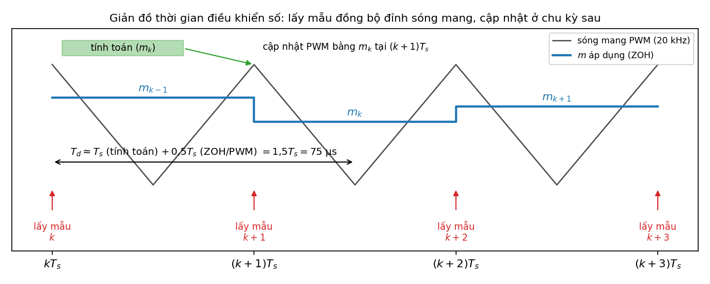
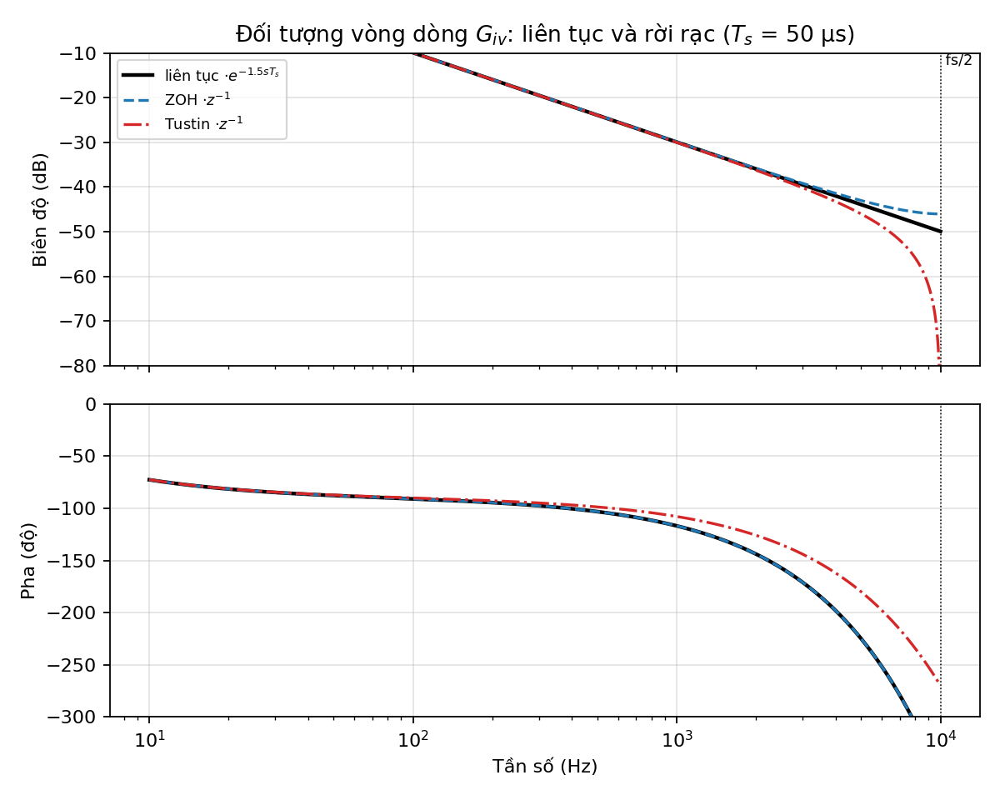
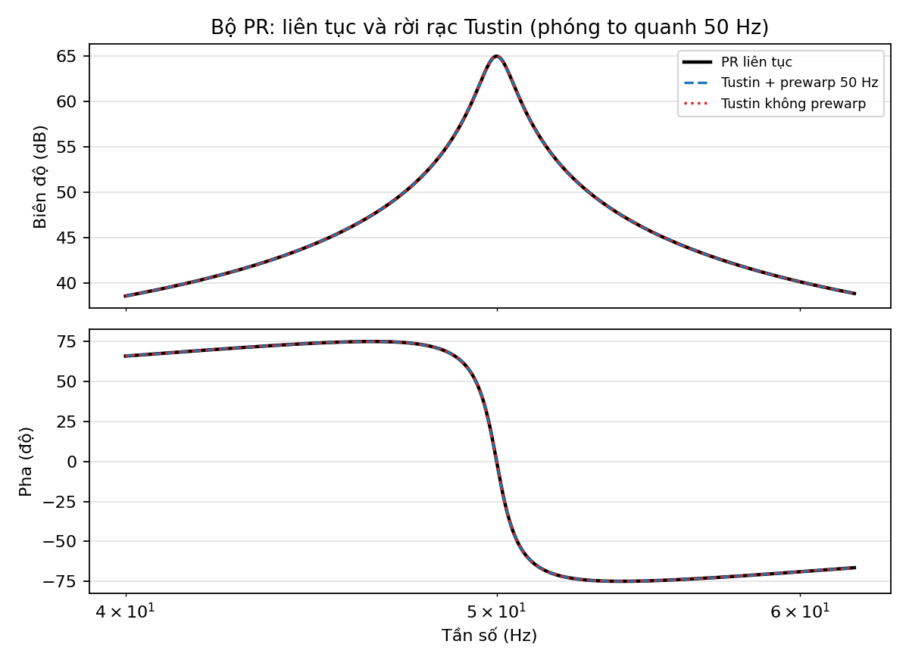
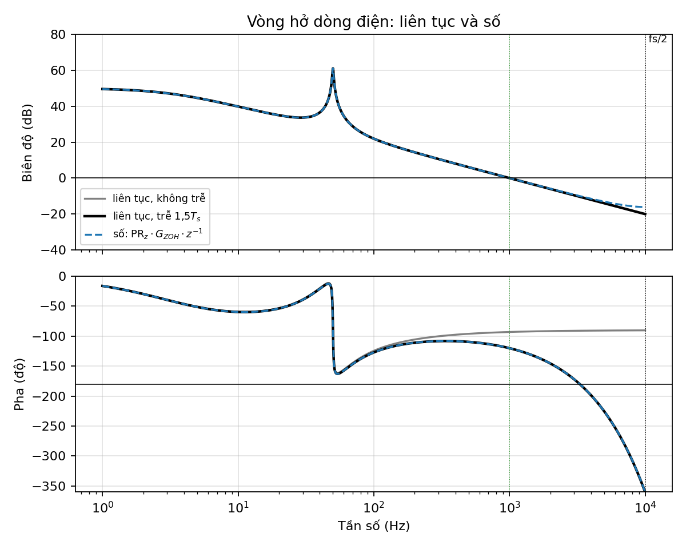
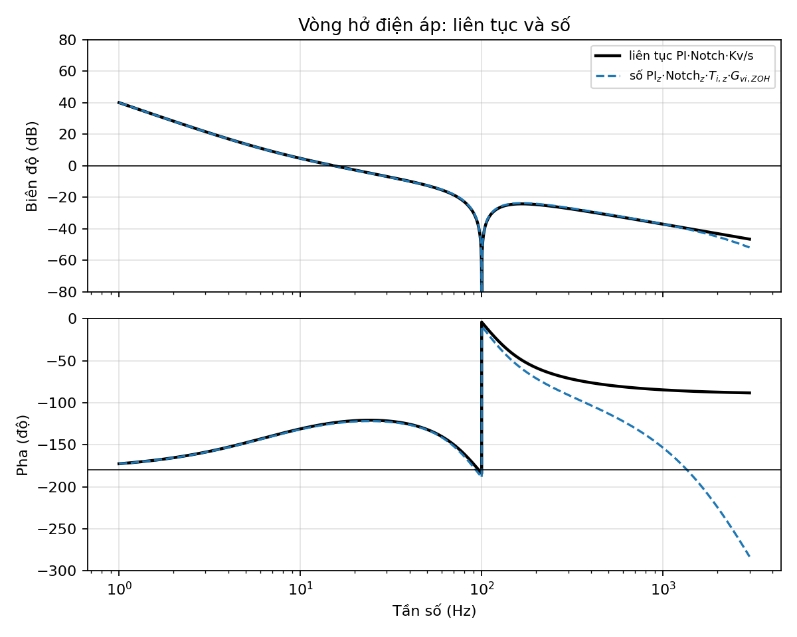
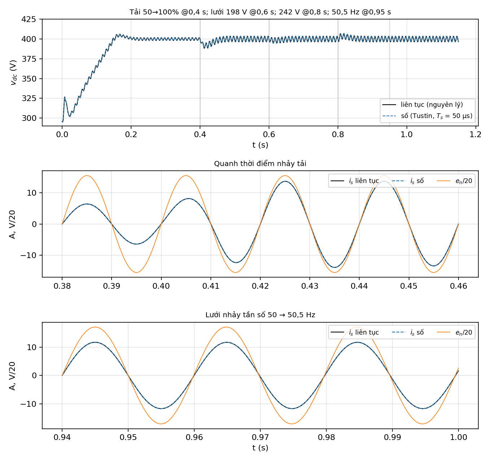

# PHẦN 5. THIẾT KẾ ĐIỀU KHIỂN SỐ – RỜI RẠC HÓA THEO XẤP XỈ TUSTIN

> Tiếp nối [Ly_thuyet_Phan1-3_va_goi_y_Phan5.md](Ly_thuyet_Phan1-3_va_goi_y_Phan5.md). Mọi con số được tính bởi [digital_tustin.py](digital_tustin.py) (kết quả: [digital_output.txt](digital_output.txt)).
> Mã cho Simulink: [ctrl_digital_step.m](ctrl_digital_step.m) (MATLAB Function block) và [params_digital_tustin.m](params_digital_tustin.m) (hệ số cho các khối Discrete Transfer Fcn).

---

## 5.1 Hướng thiết kế

Dùng **thiết kế gián tiếp (emulation)**:
1. thiết kế các bộ điều chỉnh liên tục (đã làm ở Phần 3);
2. rời rạc hóa **bộ điều khiển** bằng Tustin (prewarp tại các tần số quan trọng);
3. rời rạc hóa **mô hình đối tượng** để kiểm tra ổn định trong miền $z$;
4. mô phỏng so sánh điều khiển số với điều khiển liên tục (mô phỏng nguyên lý).

Thiết kế gián tiếp chỉ đúng khi tần số lấy mẫu đủ lớn so với băng thông và trễ của khâu số đã được tính đến. Cả hai điều kiện đều thỏa ở đây:
- $f_{ci}/f_s$ = 1 kHz / 20 kHz = 1/20;
- ở Phần 3, PR đã được thiết kế với đối tượng $e^{-1{,}5sT_s}/(Ls+r_L)$.

### Cấu trúc thời gian của bộ điều khiển số



- **Chu kỳ lấy mẫu** $T_s$ = 1/$f_s$ = **50 µs** cho mọi mạch vòng (dòng, áp, PLL). Dùng một tốc độ cho đơn giản; vòng áp có thể chạy chậm hơn (1–2 kHz) nếu cần giảm tải tính toán.
- **Lấy mẫu đồng bộ đỉnh sóng mang:** tại thời điểm này dòng điện đúng bằng giá trị trung bình trong chu kỳ, nên không bị lẫn gợn đóng cắt và không cần lọc chống chồng phổ.
- **Cập nhật PWM ở chu kỳ sau** (trễ tính toán $z^{-1}$). Cộng với trễ trung bình 0,5$T_s$ của khâu giữ (ZOH/PWM), tổng trễ là $T_d$ = 1,5$T_s$ = 75 µs, đúng như giả thiết ở Phần 3.

---

## 5.2 Phép biến đổi Tustin

Tustin (song tuyến) là phép thay tích phân liên tục bằng **tích phân hình thang**:

$$y[k]=y[k-1]+\frac{T_s}{2}\big(x[k]+x[k-1]\big)\ \Rightarrow\ \frac{Y(z)}{X(z)}=\frac{T_s}{2}\frac{1+z^{-1}}{1-z^{-1}}\ \leftrightarrow\ \frac1s
\qquad\Longrightarrow\qquad \boxed{s\leftarrow\frac{2}{T_s}\,\frac{z-1}{z+1}}$$

**Tính chất:**
- Ánh xạ toàn bộ nửa trái mặt phẳng $s$ vào trong đường tròn đơn vị, nên **bộ điều khiển ổn định vẫn ổn định** sau khi rời rạc hóa.
- Không thêm trễ, giữ bậc của hàm truyền.
- **Méo tần số:** với $z=e^{j\Omega T_s}$ thì $s=j\frac{2}{T_s}\tan\frac{\Omega T_s}{2}$. Nghĩa là tần số số $\Omega$ tương ứng với tần số liên tục $\omega_a=\frac{2}{T_s}\tan\frac{\Omega T_s}{2}$.

**Prewarping:** để đáp ứng tại tần số $\omega^*$ được giữ **chính xác**, thay hằng số $2/T_s$ bằng $K$:

$$s\leftarrow K\,\frac{z-1}{z+1},\qquad K=\frac{\omega^*}{\tan(\omega^*T_s/2)}$$

| Khâu | Tần số prewarp | $K$ |
|---|---|---|
| PI áp, PI PLL, đối tượng | không cần | $2/T_s$ = 40 000 |
| PR, SOGI | $\omega_0$ = 2π·50 | 39 999,18 |
| Notch | $\omega_N$ = 2π·100 | 39 996,71 |

**Công thức tổng quát cho khâu bậc 2** (dùng cho PR, Notch, SOGI). Với

$$G(s)=\frac{n_0s^2+n_1s+n_2}{s^2+d_1s+d_2}$$

thay $s=K(z-1)/(z+1)$ và nhân cả tử lẫn mẫu với $(z+1)^2$, đặt $a_0=K^2+d_1K+d_2$:

$$G(z)=\frac{b_0+b_1z^{-1}+b_2z^{-2}}{1+a_1z^{-1}+a_2z^{-2}},\quad
\begin{cases}
b_0=(n_0K^2+n_1K+n_2)/a_0\\
b_1=2(n_2-n_0K^2)/a_0\\
b_2=(n_0K^2-n_1K+n_2)/a_0
\end{cases}\quad
\begin{cases}
a_1=2(d_2-K^2)/a_0\\
a_2=(K^2-d_1K+d_2)/a_0
\end{cases}$$

---

## 5.3 Rời rạc hóa mô hình đối tượng

### a) Đối tượng vòng dòng $G_{iv}(s)=\dfrac{1}{Ls+r_L}$

**Tustin:**

$$G_{iv}^{T}(z)=\frac{T_s\,(z+1)}{(2L+r_LT_s)\,z-(2L-r_LT_s)}=\frac{4{,}9975\cdot10^{-3}\,(1+z^{-1})}{1-0{,}9990005\,z^{-1}}$$

Phương trình sai phân: $i_s[k]=0{,}9990005\,i_s[k-1]+4{,}9975\cdot10^{-3}\big(u_L[k]+u_L[k-1]\big)$

**ZOH** (để đối chiếu; chính xác tại các thời điểm lấy mẫu vì PWM giữ $m$ không đổi trong $T_s$):

$$G_{iv}^{ZOH}(z)=(1-z^{-1})\,\mathcal Z\!\left\{\frac{G_{iv}(s)}{s}\right\}=\frac{(1-e^{-r_LT_s/L})/r_L}{z-e^{-r_LT_s/L}}=\frac{9{,}995\cdot10^{-3}\,z^{-1}}{1-0{,}9990005\,z^{-1}}$$

### b) Đối tượng vòng áp $G_{vi}(s)=\dfrac{K_v}{s}$, với $K_v$ = 176,8

$$G_{vi}^{T}(z)=\frac{K_vT_s}{2}\frac{1+z^{-1}}{1-z^{-1}}=\frac{4{,}4194\cdot10^{-3}(1+z^{-1})}{1-z^{-1}},\qquad
G_{vi}^{ZOH}(z)=\frac{K_vT_s\,z^{-1}}{1-z^{-1}}=\frac{8{,}8388\cdot10^{-3}z^{-1}}{1-z^{-1}}$$

Với tải trở 80 Ω (Tustin): $G_{vi,R}^T(z)=\dfrac{4{,}4182\cdot10^{-3}(1+z^{-1})}{1-0{,}99943\,z^{-1}}$.

### c) So sánh, kèm trễ tính toán $z^{-1}$

| Tần số | Liên tục · $e^{-1{,}5sT_s}$ | Tustin · $z^{-1}$ | ZOH · $z^{-1}$ |
|---|---|---|---|
| 50 Hz | −87,71° / 0,6353 | −87,26° / 0,6353 | −87,71° / 0,6353 |
| 1 kHz ($f_{ci}$) | **−116,82°** / 0,0318 | **−107,82°** / 0,0316 | **−116,82°** / 0,0320 |
| 5 kHz | 135,0° / 0,0064 | −180,0° / 0,0050 | 135,0° / 0,0071 |



**Nhận xét:**
- Ở tần số thấp (50 Hz) mô hình Tustin và ZOH gần như trùng nhau.
- Ở $f_{ci}$, **mô hình Tustin thiếu 9° pha**. Lý do: Tustin giả thiết tín hiệu vào biến thiên tuyến tính giữa hai mẫu, nên không mô tả được trễ 0,5$T_s$ của khâu giữ (PWM giữ $m$ không đổi trong cả chu kỳ). Hệ quả là PM bị đánh giá lạc quan: 69° thay vì 60° (mục 5.5).
- **Kết luận:** Tustin dùng để rời rạc hóa **bộ điều khiển**. Để kiểm tra ổn định, mô hình đối tượng nên dùng **ZOH** (khớp hoàn toàn với mô hình liên tục có $e^{-1{,}5sT_s}$). Nếu buộc dùng Tustin cho đối tượng thì phải cộng thêm trễ 0,5$T_s$.

---

## 5.4 Rời rạc hóa bộ điều khiển (Tustin)

### a) Bộ PR dòng điện (dạng không lý tưởng, prewarp 50 Hz)

$$G_{PR}(s)=K_p+\frac{K_rs}{s^2+2\omega_{rc}s+\omega_0^2}=\frac{K_ps^2+(2\omega_{rc}K_p+K_r)s+K_p\omega_0^2}{s^2+2\omega_{rc}s+\omega_0^2}$$

với $K_p$ = 31,368, $K_r$ = 10 930,8, $\omega_{rc}$ = π, $\omega_0$ = 314,16 rad/s. Thay vào công thức 5.2:

$$G_{PR}(z)=\frac{31{,}6408535-62{,}7176863\,z^{-1}+31{,}0845710\,z^{-2}}{1-1{,}999439207\,z^{-1}+0{,}999685903\,z^{-2}}$$

$$\boxed{u_L[k]=31{,}6408535\,e_i[k]-62{,}7176863\,e_i[k-1]+31{,}0845710\,e_i[k-2]+1{,}999439207\,u_L[k-1]-0{,}999685903\,u_L[k-2]}$$

Có thể tách thành **$K_p$ + khâu cộng hưởng** để dễ quan sát và chỉnh tham số:

$$u_L=K_p\,e_i+R(z)\,e_i,\qquad R(z)=\frac{0{,}2732158\,(1-z^{-2})}{1-1{,}999439\,z^{-1}+0{,}999686\,z^{-2}}$$

Dạng PR lý tưởng ($\omega_{rc}$ = 0) để tham khảo: $b$ = [31,64090; −62,72754; 31,09438], $a$ = [1; −1,9997533; 1]. Hai cực nằm **đúng trên** đường tròn đơn vị tại góc $\pm\omega_0T_s$, tương ứng khuếch đại vô cùng đúng tại 50 Hz.

**Kiểm tra:**

| | Liên tục | Tustin + prewarp | Tustin không prewarp |
|---|---|---|---|
| $\lvert G_{PR}\rvert$ tại 50 Hz | 1771,053 ∠0° | 1771,053 ∠0,00° | 1771,049 ∠−0,12° |
| Đỉnh cộng hưởng | 50 Hz | 50 Hz | 49,999 Hz |



Ở $f_s$ = 20 kHz, không prewarp chỉ làm đỉnh cộng hưởng lệch khoảng 0,001 Hz. Tuy nhiên độ lệch tỉ lệ với $(\omega T_s)^2$:

| Bộ cộng hưởng | $f_s$ = 20 kHz | $f_s$ = 5 kHz |
|---|---|---|
| Bậc 1 (50 Hz) | 49,999 Hz | 49,984 Hz |
| Bậc 3 (150 Hz) | 149,97 Hz | 149,56 Hz |
| Bậc 5 (250 Hz) | 249,87 Hz | 247,97 Hz |
| Bậc 7 (350 Hz) | 349,65 Hz | 344,52 Hz |

⇒ khi bù sóng hài hoặc dùng $f_s$ thấp thì **bắt buộc prewarp**.

### b) Bộ PI điện áp (Tustin, không prewarp)

$$G_{PI}(z)=\frac{b_0+b_1z^{-1}}{1-z^{-1}},\quad b_0=K_p+\frac{K_iT_s}{2}=0{,}5031372,\quad b_1=-K_p+\frac{K_iT_s}{2}=-0{,}5020206$$

Viết dạng vị trí để chống bão hòa tích phân (anti-windup kiểu kẹp – clamping):

$$x_I[k]=x_I[k-1]+\frac{K_iT_s}{2}\big(e_v[k]+e_v[k-1]\big),\qquad I_m^*[k]=\mathrm{sat}_{[0;\,20\,\mathrm A]}\big(K_p\,e_v[k]+x_I[k]\big)$$

Khi đầu ra đã bão hòa mà $e_v$ còn đẩy tiếp ra ngoài giới hạn thì **giữ nguyên** $x_I$.

### c) Notch 100 Hz (prewarp 100 Hz)

$$G_N(z)=\frac{0{,}9845375-1{,}9681033\,z^{-1}+0{,}9845375\,z^{-2}}{1-1{,}9681033\,z^{-1}+0{,}9690749\,z^{-2}}$$

Nhờ prewarp, điểm không nằm đúng tại 100 Hz ($|G_N|$ = 1·10⁻¹³). Hệ số $b_1=a_1$ là tính chất của bộ notch.

### d) SOGI (prewarp 50 Hz)

$$D(z)=\frac{v'}{e_n}=\frac{0{,}01098475\,(1-z^{-2})}{1-1{,}9777865\,z^{-1}+0{,}9780305\,z^{-2}}$$

$$Q(z)=\frac{qv'}{e_n}=\frac{8{,}627577\cdot10^{-5}\,(1+2z^{-1}+z^{-2})}{1-1{,}9777865\,z^{-1}+0{,}9780305\,z^{-2}}$$

- Tại 50 Hz: $D=1\angle0^\circ$, $Q=1\angle-90^\circ$ **chính xác**, nên hai tín hiệu trực giao hoàn hảo.
- Cài $D(z)$ và $Q(z)$ thành **hai bộ lọc riêng** tránh được vòng đại số. Nếu rời rạc hóa từng khâu tích phân trong sơ đồ SOGI bằng Tustin thì sẽ xuất hiện vòng đại số.
- Với $\omega_0$ cố định, khi lưới lệch ±1% thì $D$ lệch pha khoảng ∓0,81° (tính: +0,814° tại 49,5 Hz; −0,806° tại 50,5 Hz). Dòng điện vì thế lệch pha theo, nhưng PF vẫn bằng 0,9999 (mục 5.6). Có thể loại bỏ sai lệch này bằng SOGI thích nghi tần số (đưa $\hat\omega$ từ PLL về SOGI, như đường màu đỏ ở [BG] Hình 5.4).

### e) PLL: PI (Tustin) + bộ tạo góc NCO (Euler tiến)

$$\Delta\omega[k]=\Delta\omega[k-1]+0{,}5723813\,e_q[k]-0{,}5698435\,e_q[k-1]\quad(\text{giới hạn }\pm2\pi\cdot5\ \text{rad/s})$$

$$\omega[k]=\omega_0+\Delta\omega[k],\qquad \hat\theta[k+1]=\big(\hat\theta[k]+T_s\,\omega[k]\big)\bmod 2\pi$$

NCO dùng **Euler tiến** ($T_sz^{-1}/(1-z^{-1})$) thay vì Tustin. Lý do: $e_q[k]$ được tính từ $\hat\theta[k]$, nên nếu $\hat\theta[k]$ lại phụ thuộc $\omega[k]$ (như với Tustin) thì sinh vòng đại số. PM của PLL gần như không đổi: 65,5° → 65,2°.

### f) Bảng tổng hợp hệ số (dạng $b_0+b_1z^{-1}+b_2z^{-2}$ / $1+a_1z^{-1}+a_2z^{-2}$)

| Khối | $b_0$ | $b_1$ | $b_2$ | $a_1$ | $a_2$ |
|---|---|---|---|---|---|
| PR dòng (prewarp 50 Hz) | 31,6408535 | −62,7176863 | 31,0845710 | −1,999439207 | 0,999685903 |
| PI áp | 0,5031372 | −0,5020206 | – | −1 | – |
| Notch 100 Hz | 0,9845375 | −1,9681033 | 0,9845375 | −1,9681033 | 0,9690749 |
| SOGI $D$ | 0,01098475 | 0 | −0,01098475 | −1,9777865 | 0,9780305 |
| SOGI $Q$ | 8,627577e−5 | 1,725515e−4 | 8,627577e−5 | −1,9777865 | 0,9780305 |
| PI PLL | 0,5723813 | −0,5698435 | – | −1 | – |

**Lưu ý số học:** cực của PR, Notch và SOGI nằm rất gần $z$ = 1 (ví dụ $a_2$ = 0,99969), nên hệ số cần **ít nhất 7–8 chữ số có nghĩa**. Trên vi điều khiển nên dùng số thực double, hoặc float32 với cấu trúc Direct Form II Transposed (DF2T). Tránh dùng số nguyên Q15 trực tiếp.

---

## 5.5 Kiểm tra ổn định trong miền z

Vòng hở được tính trên đường tròn đơn vị $z=e^{j\omega T_s}$, với đối tượng ZOH và trễ tính toán $z^{-1}$:

| Mạch vòng | Mô hình | $f_c$ | PM | GM |
|---|---|---|---|---|
| Dòng điện | liên tục, không trễ | 1000 Hz | 87,0° | ∞ |
| | liên tục, $e^{-1{,}5sT_s}$ (thiết kế Phần 3) | 1000 Hz | 60,0° | 10,4 dB |
| | **số: $G_{PR}(z)\,G_{iv}^{ZOH}(z)\,z^{-1}$** | **1004 Hz** | **59,9°** | **10,0 dB** |
| | số với đối tượng Tustin (lạc quan) | 992 Hz | 69,1° | 16,0 dB |
| Điện áp | liên tục $G_{PI}G_NK_v/s$ | 15,4 Hz | 56,3° | 39,4 dB |
| | **số: $G_{PI}(z)G_N(z)T_i(z)G_{vi}^{ZOH}(z)$** | **15,3 Hz** | **55,4°** | **32,6 dB** |
| | số, tải trở 80 Ω | 15,2 Hz | 62,1° | 33,9 dB |
| PLL | liên tục | 31,1 Hz | 65,5° | ∞ |
| | số (PI Tustin + NCO Euler) | 31,1 Hz | 65,2° | ∞ |

($T_i(z)$ là hàm truyền kín của vòng dòng số.)

**Cực của hệ kín.** Đổi sang miền $s$ bằng $s=\ln z/T_s$:
- Vòng dòng: $z$ = 0,99060 ± j0,01307 ($|z|$ = 0,99068) ⇒ $s$ ≈ −187 ± j264, tức hằng số thời gian 5,3 ms. Đây là cặp cực cộng hưởng, khớp với ước lượng $\tau=2K_p/K_r$ = 5,7 ms ở Phần 3. Cặp cực còn lại $z$ = 0,5086 ± j0,2405 ($|z|$ = 0,563, ≈ 1,4 kHz) là động học nhanh của vòng dòng.
- Vòng áp: $\max|z|$ = 0,99756 ⇒ hằng số thời gian ≈ 20 ms.
- Tất cả cực đều nằm trong đường tròn đơn vị ⇒ **hệ số ổn định**.




**Nhận xét quan trọng:** PM của vòng dòng số (59,9°) gần như bằng thiết kế (60°). Đó là nhờ trễ 1,5$T_s$ đã được đưa vào ngay từ Phần 3. Nếu thiết kế PR trên đối tượng không trễ với PM = 60° rồi mới rời rạc hóa, PM thực tế sẽ chỉ còn khoảng 33°.

---

## 5.6 Thuật toán một chu kỳ lấy mẫu

```text
Tại mỗi đỉnh sóng mang (k·Ts):
 0. Xuất m[k-1] ra PWM                                       (trễ tính toán z^-1)
 1. Đọc ADC: i_s[k], v_dc[k], e_n[k]
 2. SOGI:   v'[k] = D(z){e_n},  qv'[k] = Q(z){e_n}
 3. PLL:    e_q = v' cos θ[k] + qv' sin θ[k]
            Δω = PI_pll(e_q);  ω = ω0 + Δω;  θ[k+1] = (θ[k] + Ts·ω) mod 2π
 4. Vòng áp: v_f = Notch(z){v_dc};  I_m* = PI_v(v_dc* − v_f)   (giới hạn [0, 20 A], kẹp tích phân)
 5. i_s* = I_m* · sin θ[k]
 6. Vòng dòng: u_L = PR(z){i_s* − i_s}
 7. m[k] = sat_[−1,1]( (e_n[k] − u_L) / v_dc[k] )           (feedforward + chuẩn hóa)
```

Thuật toán đã được cài đặt trong [ctrl_digital_step.m](ctrl_digital_step.m) (MATLAB) và trong hàm `simulate(digital=True)` của [digital_tustin.py](digital_tustin.py) (Python). Hai bản dùng cùng công thức hệ số. Tôi đã viết lại hàm `tustin2` của file .m bằng Python và so với hệ số ở bảng 5.4f: sai khác bằng 0. Riêng file .m chưa được chạy trong MATLAB (máy làm bài không có MATLAB), nên lần chạy đầu cần xem kết quả in ra có khớp bảng 5.4f không.

---

## 5.7 Mô phỏng kiểm chứng: điều khiển số so với điều khiển liên tục

**Điều kiện mô phỏng:**
- Mạch lực: mô hình trung bình (3.2), bước tích phân 2 µs.
- Bộ điều khiển liên tục (mô phỏng nguyên lý): các phương trình vi phân của Phần 3, không trễ.
- Bộ điều khiển số: các phương trình sai phân ở 5.4, lấy mẫu 50 µs, ZOH, trễ $z^{-1}$.
- Kịch bản:
  - khởi động với 50% tải, $v_{dc}^*$ tăng dốc từ 296 V lên 400 V;
  - $t$ = 0,4 s: tải 50% → 100%;
  - $t$ = 0,6 s: lưới 220 V → 198 V;
  - $t$ = 0,8 s: lưới → 242 V;
  - $t$ = 0,95 s: tần số 50 Hz → 50,5 Hz.



| Chế độ | Liên tục: $V_{dc}$ / gợn pp / THD / φ / PF | Số: $V_{dc}$ / gợn pp / THD / φ / PF |
|---|---|---|
| 50% tải, 220 V | 400,0 V / 3,62 V / 0,02% / 0,01° / 1,0000 | 400,0 V / 3,62 V / 0,02% / −0,01° / 1,0000 |
| 100% tải, 220 V | 400,0 / 7,33 / 0,03% / 0,01° / 1,0000 | 400,0 / 7,33 / 0,03% / −0,02° / 1,0000 |
| 100% tải, 198 V | 400,0 / 7,29 / 0,02% / 0,01° / 1,0000 | 400,0 / 7,29 / 0,03% / −0,01° / 1,0000 |
| 100% tải, 242 V | 400,1 / 7,59 / 0,05% / −0,01° / 1,0000 | 400,1 / 7,59 / 0,06% / −0,04° / 1,0000 |
| 100% tải, 242 V, 50,5 Hz | 400,0 / 7,16 / 0,20% / −0,84° / 0,9999 | 400,0 / 7,15 / 0,22% / −0,86° / 0,9999 |
| Nhảy tải 50→100%: $V_{dc}$ min | 388,3 V (sụt 11,7 V) | 388,3 V (sụt 11,7 V) |

Sai khác lớn nhất giữa hai mô phỏng (sau 0,3 s): 0,01 V với $v_{dc}$ và 0,042 A với $i_s$.

**Nhận xét:**
1. Điều khiển số bám gần như trùng điều khiển liên tục ở cả xác lập lẫn quá độ, vì:
   - $f_s$ đủ cao (1/20 so với $f_{ci}$),
   - prewarp giữ đúng đặc tính tại 50/100 Hz,
   - trễ số đã được tính đến khi thiết kế.
2. Lệch pha −0,84° khi tần số lưới bằng 50,5 Hz là do SOGI dùng $\omega_0$ cố định (mục 5.4d), không phải do rời rạc hóa: nó xuất hiện ở cả hai mô phỏng.
3. THD ở đây rất nhỏ vì mô hình trung bình không có gợn đóng cắt. Trong mô phỏng đóng cắt (Simulink) THD sẽ lớn hơn (gợn 0,5 A pp ở 40 kHz) nhưng vẫn phải < 5%.

---

## 5.8 Hướng dẫn cài đặt trong Simulink (cho phần mô phỏng)

**Cách 1 – MATLAB Function block** (khuyến nghị, ít lỗi nhất):
1. Đặt [ctrl_digital_step.m](ctrl_digital_step.m) cùng thư mục với mô hình.
2. Tạo MATLAB Function block với nội dung:
   ```matlab
   function [m, i_ref, theta, Im] = fcn(i_s, v_dc, e_n, vdc_ref)
   [m, i_ref, theta, Im] = ctrl_digital_step(i_s, v_dc, e_n, vdc_ref);
   ```
3. Đặt *Sample time* của block = `Ts` = 50e-6.
4. Đưa 3 tín hiệu đo qua khối **Zero-Order Hold** (`Ts`).
5. Nối $m$ vào bộ PWM đơn cực có sóng mang 20 kHz, **đồng bộ** sao cho đỉnh sóng mang trùng các bội số của $T_s$.

Hàm đã tự thực hiện trễ $z^{-1}$, nên **không** đặt thêm Unit Delay.

**Cách 2 – dùng khối chuẩn.** Chạy [params_digital_tustin.m](params_digital_tustin.m), sau đó:

| Khâu | Khối Simulink | Tham số |
|---|---|---|
| PR | Discrete Transfer Fcn | `PR_b`, `PR_a`, `Ts` |
| Notch | Discrete Transfer Fcn | `NO_b`, `NO_a` |
| SOGI | 2 khối Discrete Transfer Fcn | `SD_b/SD_a` và `SQ_b/SQ_a` |
| PI áp | Discrete PID Controller (PI) | Integrator method: **Trapezoidal** (= Tustin); P = `Kp_v`; I = `Ki_v`; Output saturation [0, `Im_max`]; Anti-windup: **clamping** |
| PI PLL | Discrete PID Controller (PI) | Trapezoidal; `Kp_pll`, `Ki_pll` |
| NCO | Discrete-Time Integrator | Forward Euler, rồi qua `mod(·, 2π)` |
| Trễ tính toán | Unit Delay | đặt trước PWM |

**So sánh với mô phỏng nguyên lý (Phần 4):** chạy cùng một kịch bản cho mô hình liên tục và mô hình số. So sánh: dạng sóng $v_{dc}$, $i_s$; THD và PF; độ sụt và thời gian hồi phục khi nhảy tải; đáp ứng khi lưới ±10% và tần số ±1%. Có thể làm thêm:
- giảm $f_s$ xuống 10 kHz và 5 kHz để thấy PM giảm (do trễ $1{,}5T_s$ tăng) và ảnh hưởng của việc không prewarp;
- thêm lượng tử hóa ADC 12 bit.

---

## 5.9 Kết luận Phần 5

- Đối tượng đã được rời rạc hóa bằng Tustin ($G_{iv}$, $G_{vi}$) và đối chiếu với ZOH. Tustin phù hợp cho bộ điều khiển. Để đánh giá ổn định, đối tượng nên dùng ZOH, vì Tustin bỏ qua trễ 0,5$T_s$ của khâu giữ và làm PM bị đánh giá cao thêm khoảng 9°.
- Toàn bộ bộ điều khiển (PR, PI áp, Notch, SOGI, PI-PLL) đã được rời rạc hóa bằng Tustin, prewarp tại 50/100 Hz cho các khâu cộng hưởng và notch. Đã có hệ số và phương trình sai phân sẵn để cài đặt.
- Trong miền $z$ hệ ổn định với dự trữ gần như giữ nguyên so với thiết kế liên tục: vòng dòng PM 59,9°, GM 10 dB; vòng áp PM 55,4°.
- Mô phỏng (mô hình trung bình) cho kết quả số trùng với liên tục: sai khác < 0,05 A và < 0,01 V.

### Tài liệu tham khảo
1. L. Corradini, D. Maksimović, P. Mattavelli, R. Zane, *Digital Control of High-Frequency Switched-Mode Power Converters*, Wiley, 2015.
2. A. G. Yepes et al., "Effects of Discretization Methods on the Performance of Resonant Controllers," *IEEE Trans. Power Electronics*, vol. 25, no. 7, 2010.
3. R. Teodorescu, M. Liserre, P. Rodríguez, *Grid Converters for Photovoltaic and Wind Power Systems*, Wiley, 2011.
4. M. Ciobotaru, R. Teodorescu, F. Blaabjerg, "A New Single-Phase PLL Structure Based on Second Order Generalized Integrator," *IEEE PESC*, 2006.
